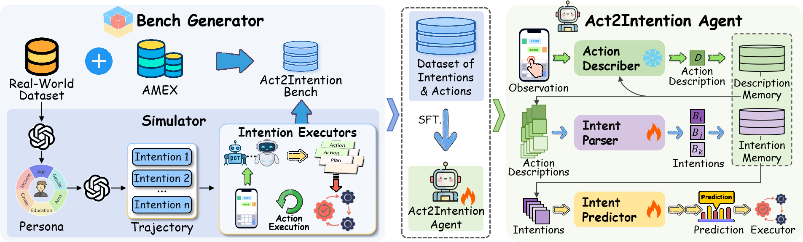
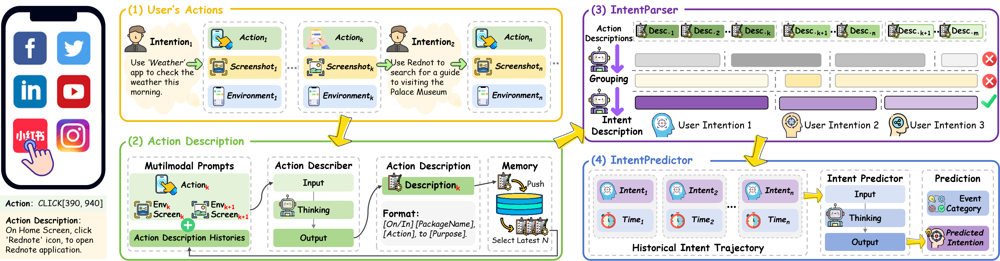

<h1 align= "center"> Act2Intention </h1>


<p align="center">
  📝<a href="#overview">Overview</a>  | 🤗
  <a href="https://huggingface.co/datasets/BBKKBKK0nancy/Act2Intention">Data Release</a> 
</p>


<br>
<div align="center">

</div>
<br>

## 📝 Overview
Mobile GUI agents powered by MLLMs show promise in human-computer intelligence. However, current research primarily focuses on reactive task execution while lacking major capabilities for proactively inferring user intentions, which are the core requirements of active agents. In this paper, we propose the Act2Intention framework that builds an active mobile agent by integrating understanding, predicting user intentions, and executing decisions. 

To realize this paradigm, we introduce Act2Intention Bench, the first comprehensive dataset designed for studying agents based on GUI action trajectories. It contains 1,600 user intentions with 17,000+ GUI actions across 52 applications. We further develop Act2Intention Agent, a multi-agent framework (based on Qwen2.5-7B/Llama3.1-8B) combining three specialized agents: ActionDescriber for GUI-action description, IntentParser for semantic intention clustering (100% grouping accuracy), and IntentPredictor for potential intention predicting (54.2% prediction accuracy). Experimental results demonstrate significant performance gains, showing the effectiveness of the Act2Intention Bench. And the Act2Intention framework establishes the GUI intention inference as a promising direction for mobile GUI agents.

🔥 **Features** :
- **Bench Generation**: A framework that generate continuous "action-intention" trajectories for training and evaluating Active Mobile GUI Agents.
- **Act2Intention Agent**: A multi-agent framework that understands, predicts user intention, and provides active services by analyzing historical GUI actions.


## 📊 Bench

We construct the Act2Intention Bench, the first dataset designed for inferring user intention from GUI actions. It comprises:
- 1,600 user intentions cross 100 users
- 17,000+ GUI actions
- 52 mobile applications


## 🤖 Act2Intention Agent

The Act2Intention Agent is designed as a modular architecture that proactively understands intentions and predicts human potential needs, based on raw GUI interactions. To be more specific:
1. **ActionDescriber** employ VLM as an action describer to accurately translate raw observation sequences into action descriptions, described in natural language
2. **IntentParser** infer the intentions represented behind these action descriptions by fine-tuned LLM
3. **IntentPredictor** predict potential user intention based on historical information using another fine-tuned LLM

<div align="center">

</div>

## 🚀 Start !

### Step 1: Environment Preparation

Clone this repository
```bash
git clone https://github.com/npuNancy/Act2Intention.git
cd Act2Intention
```

Install requirements using uv, 
```bash
# Create a new virtual environment
uv venv --python 3.11
source .venv/bin/activate

# Install requirements
uv pip install -r requirements.txt
```

or using conda.
```bash
# Create a new conda environment
conda create -n act2intent python=3.11
conda activate act2intent

# Install requirements
pip install -r requirements.txt
```

### Step 2: Data Preparation


<!-- Download the dataset [Act2Intention-Bench](https://huggingface.co/datasets/BBKKBKK0nancy/Act2Intention) into `data/trajectory`. -->

Decompress the original data
```bash
unzip data/trajectory/test/test.zip -d data/trajectory/test
unzip data/trajectory/train/train.zip -d data/trajectory/train
```

Generate the dataset for training and evaluation.
```bash
python scripts/generate_stage_2.py
python scripts/generate_stage_3.py
```

#### Simulator 

You can also use Simulator to build datasets.

**Prepare** 
- prepare the user intentions. 
  - `simulator/intentions/user_demo.csv` is an example file, which contains the user intentions in the form of `<Time,APP,Intention,Event>`.
  - `Time` is the timestamp of the action.
  - `APP` is the name of the application.
  - `Intention` is the user intention.
  - `Event` is the intention's category.
- copy `.env.local` to `.env` and set the environment variables.
- prepare the Executor, such as [CogAgent](https://github.com/THUDM/CogAgent), [MobileAgent](https://github.com/X-PLUG/MobileAgent), [UI-TARS](https://github.com/bytedance/UI-TARS), etc.

**Run Simulator** 
1. generate persona: `python simulator/generate_persona.py`
2. generate intention trajectory: `simulator/generate_intention_trajectory.py`
3. generate action trajectory by Executors.

### Step 3: Train, Inference and Evaluate

We train and infer the Agent by [LLamaFactory](https://github.com/hiyouga/LLaMA-Factory).

Evaluate the Agent by `python scripts/eval_stage2.py` and `python scripts/eval_stage3.py`, and remember to modify the `filepath`.

## 📈 Results

### ActionDescriber

| Models         | Bleu-4 |
| -------------- | ------ |
| GPT-4o         | 51.00  |
| Gemini-1.5-pro | 47.37  |
| Qwen-vl-max    | 52.67  |

### IntentParser

<table>
  <thead>
    <tr>
      <th rowspan="2">Models</th>
      <th colspan="2">AiTW</th>
      <th colspan="2">Android Control</th>
      <th colspan="2">AMEX</th>
      <th colspan="2">Act2Intention Bench</th>
    </tr>
    <tr>
      <th>Acc<sub>G</sub></th>
      <th>Acc<sub>D</sub></th>
      <th>Acc<sub>G</sub></th>
      <th>Acc<sub>D</sub></th>
      <th>Acc<sub>G</sub></th>
      <th>Acc<sub>D</sub></th>
      <th>Acc<sub>G</sub></th>
      <th>Acc<sub>D</sub></th>
    </tr>
  </thead>
  <tbody>
    <tr>
      <td colspan="9"><em>Closed-source models</em></td>
    </tr>
    <tr>
      <td>GPT-3.5-turbo</td>
      <td>0.87</td>
      <td>7.48</td>
      <td>0.00</td>
      <td>1.00</td>
      <td>0.36</td>
      <td>-</td>
      <td>16.31</td>
      <td>1.91</td>
    </tr>
    <tr>
      <td>GPT-4o-mini</td>
      <td>4.30</td>
      <td>10.93</td>
      <td>11.50</td>
      <td>9.50</td>
      <td>2.01</td>
      <td>3.87</td>
      <td>20.66</td>
      <td>2.31</td>
    </tr>
    <tr>
      <td>GPT-4o</td>
      <td>24.88</td>
      <td>12.56</td>
      <td>60.46</td>
      <td>2.00</td>
      <td>1.93</td>
      <td>7.29</td>
      <td>20.08</td>
      <td>5.32</td>
    </tr>
    <tr>
      <td>Claude-3.5-haiku</td>
      <td>0.00</td>
      <td>-</td>
      <td>0.00</td>
      <td>1.00</td>
      <td>1.79</td>
      <td>-</td>
      <td>24.28</td>
      <td>4.12</td>
    </tr>
    <tr>
      <td>Claude-3.5-sonnet</td>
      <td>2.13</td>
      <td>11.04</td>
      <td>3.78</td>
      <td>9.00</td>
      <td>3.36</td>
      <td>6.89</td>
      <td>20.00</td>
      <td>6.58</td>
    </tr>
    <tr>
      <td>Qwen-max</td>
      <td>4.57</td>
      <td>10.25</td>
      <td>12.50</td>
      <td>0.00</td>
      <td>-</td>
      <td>3.40</td>
      <td>16.10</td>
      <td>4.45</td>
    </tr>
    <tr>
      <td>Gemini-1.5-pro</td>
      <td>27.49</td>
      <td>17.87</td>
      <td>51.32</td>
      <td>7.89</td>
      <td>14.00</td>
      <td>3.74</td>
      <td>68.63</td>
      <td>8.48</td>
    </tr>
    <tr>
      <td colspan="9"><em>Open-source models</em></td>
    </tr>
    <tr>
      <td>Llama-3.1-8B</td>
      <td>1.00</td>
      <td>7.11</td>
      <td>1.50</td>
      <td>2.37</td>
      <td>0</td>
      <td>-</td>
      <td>6.03</td>
      <td>1.41</td>
    </tr>
    <tr>
      <td>Llama-3.1-8B-SFT</td>
      <td>94.55</td>
      <td>46.64</td>
      <td>98.01</td>
      <td>50.20</td>
      <td>98.6</td>
      <td>49.78</td>
      <td>97.31</td>
      <td>49.83</td>
    </tr>
    <tr>
      <td>Qwen-2.5-72B</td>
      <td>6.50</td>
      <td>12.57</td>
      <td>29.00</td>
      <td>3.95</td>
      <td>2.00</td>
      <td>1.30</td>
      <td>5.33</td>
      <td>3.26</td>
    </tr>
    <tr>
      <td>Qwen-2.5-7B</td>
      <td>0.00</td>
      <td>-</td>
      <td>0.33</td>
      <td>2.22</td>
      <td>8.50</td>
      <td>1.76</td>
      <td>12.14</td>
      <td>5.21</td>
    </tr>
    <tr>
      <td>Qwen-2.5-7B-SFT</td>
      <td>95.45</td>
      <td>50.40</td>
      <td>97.01</td>
      <td>48.09</td>
      <td>100.0</td>
      <td>49.89</td>
      <td>100.0</td>
      <td>49.94</td>
    </tr>
  </tbody>
</table>

### IntentPredictor

<table>
  <thead>
    <tr>
      <th>Models</th>
      <th>Accuracy</th>
      <th>Precision</th>
      <th>Recall</th>
      <th>F1-Score</th>
      <th>BLEU-4</th>
    </tr>
  </thead>
  <tbody>
    <tr>
      <td colspan="6"><em>Closed-source models</em></td>
    </tr>
    <tr>
      <td>GPT-3.5-turbo</td>
      <td>42.50</td>
      <td>35.89</td>
      <td>48.39</td>
      <td>37.88</td>
      <td>17.13</td>
    </tr>
    <tr>
      <td>GPT-4o-mini</td>
      <td>38.50</td>
      <td>30.83</td>
      <td>40.32</td>
      <td>33.20</td>
      <td>18.36</td>
    </tr>
    <tr>
      <td>GPT-4o</td>
      <td>34.50</td>
      <td>32.25</td>
      <td>34.68</td>
      <td>31.67</td>
      <td>16.74</td>
    </tr>
    <tr>
      <td>Claude-3.5-haiku</td>
      <td>28.50</td>
      <td>34.85</td>
      <td>30.65</td>
      <td>29.56</td>
      <td>14.27</td>
    </tr>
    <tr>
      <td>Claude-3.5-sonnet</td>
      <td>15.50</td>
      <td>38.33</td>
      <td>20.16</td>
      <td>25.44</td>
      <td>16.23</td>
    </tr>
    <tr>
      <td>Qwen-max</td>
      <td>48.50</td>
      <td>39.34</td>
      <td>48.39</td>
      <td>42.43</td>
      <td>30.68</td>
    </tr>
    <tr>
      <td>Gemini-1.5pro</td>
      <td>34.50</td>
      <td>35.39</td>
      <td>30.65</td>
      <td>28.72</td>
      <td>26.86</td>
    </tr>
    <tr>
      <td colspan="6"><em>Open-source models</em></td>
    </tr>
    <tr>
      <td>Llama-3.1-8B</td>
      <td>37.80</td>
      <td>29.75</td>
      <td>45.31</td>
      <td>34.63</td>
      <td>24.87</td>
    </tr>
    <tr>
      <td>Llama-3.1-8B-SFT</td>
      <td>54.20</td>
      <td>52.73</td>
      <td>53.07</td>
      <td>51.91</td>
      <td>34.95</td>
    </tr>
    <tr>
      <td>Qwen-2.5-72B</td>
      <td>40.00</td>
      <td>35.93</td>
      <td>41.13</td>
      <td>35.35</td>
      <td>29.95</td>
    </tr>
    <tr>
      <td>Qwen-2.5-7B</td>
      <td>43.50</td>
      <td>35.95</td>
      <td>44.35</td>
      <td>37.39</td>
      <td>27.85</td>
    </tr>
    <tr>
      <td>Qwen-2.5-7B-SFT</td>
      <td>50.00</td>
      <td>50.15</td>
      <td>49.19</td>
      <td>49.11</td>
      <td>32.29</td>
    </tr>
  </tbody>
</table>

### Pipeline Evaluation


| IntentParser                | IntentPredictor               | Accuracy | Precision | Recall | F1-score | BLEU-4 |
| --------------------------- | ----------------------------- | -------- | --------- | ------ | -------- | ------ |
| Ground Truth                | LLama-3.1-8B-SFT<sup>\*</sup> | 54.20    | 52.73     | 53.07  | 51.91    | 34.95  |
| Gemini-1.5pro               | LLama-3.1-8B-SFT<sup>\*</sup> | 29.00    | 36.75     | 39.23  | 35.94    | 9.51   |
| Qwen-2.5-7B                 | LLama-3.1-8B-SFT<sup>\*</sup> | 20.80    | 28.02     | 29.11  | 27.28    | 8.97   |
| Qwen-2.5-7B-SFT<sup>†</sup> | LLama-3.1-8B-SFT<sup>\*</sup> | 32.86    | 31.81     | 30.06  | 30.29    | 11.40  |

<sup>†</sup>: SFT model for IntentParser; <sup>*</sup>: SFT model for IntentPredictor.

<!-- ## 📝 Citation -->

